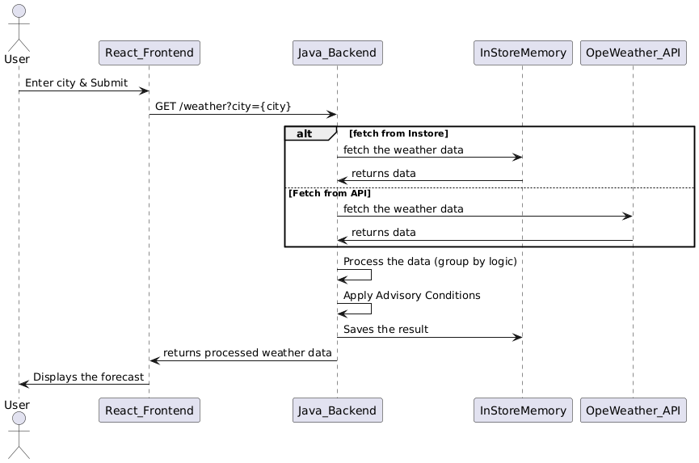

## Sample Weather Service


This Spring boot service, has 1 controller which takes city as Path param.

Based on the pathParam value it makes and API call to OpenWeather API with count as 24(3 days). 
Then it groups the response by date. And returns the max, min Temperature for the particular date.
It also generates the advisory based on the below conditions:

If rain is predicted in next 3 days or temperature goes above 40 degree Celsius then mention 'Carry umbrella' or 'Use sunscreen lotion' respectively in the output, for that day;

In case of high winds (i.e.,) Wind > 10mph, mention “It’s too windy, watch out!”

In case of Thunderstorms, mention “Don’t step out! A Storm is brewing!

Sequence Diagram:
PLANTUML script
```
@startuml
actor User
User -> React_Frontend: Enter city & Submit
React_Frontend -> Java_Backend: GET /weather?city={city}
alt fetch from Instore
   Java_Backend -> InStoreMemory: fetch the weather data
   InStoreMemory -> Java_Backend: returns data
else Fetch from API
   Java_Backend -> OpeWeather_API: fetch the weather data
   OpeWeather_API -> Java_Backend: returns data
end

Java_Backend -> Java_Backend: Process the data (group by logic)
Java_Backend -> Java_Backend: Apply Advisory Conditions
Java_Backend -> InStoreMemory: Saves the result

Java_Backend -> React_Frontend: returns processed weather data
React_Frontend -> User: Displays the forecast
@enduml
```




